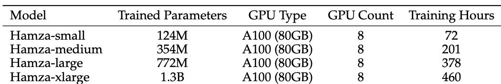

# **Pre-training**

## **Step-1: Environment Setup**

```bash
conda create --name llm_tr_pretrain python=3.12 -y
conda activate llm_tr_pretrain
```

Clone the repository and install dependencies **if you have note before**:

```bash
git clone https://github.com/emrecanacikgoz/turkish-llm.git
cd turkish-llm
pip install -r requirements.txt
```

---

## **Step-2: Dataset Creation**
Now first we should tokenize the pretraining dataset. We will use Turkish corpus of [culturax](https://huggingface.co/datasets/uonlp/CulturaX) dataset which includes 129,486,207,634 tokens in total.

To prepare dataset, we will need 128 cores at least for time efficiency. This tokenization should take aroun 12 hours.
```bash
cd pretraining/data/culturax
source prepare.sh
```

However, you can make a pretraining on small data by using only one file; to do that make `SMALL_DATA=True` flag in prepare.py.


## Step-3 Pretraining**
Now after your dataset is ready, you can train 4 variants of GPT as: small, medium, large, xlarge. It will use 1 node and 8xH100 in parallel for training.

```bash
# train gpt-small
source pretrain-multi-gpu-gpt-s

# train gpt-medium
source pretrain-multi-gpu-gpt-m

# train gpt-large
source pretrain-multi-gpu-gpt-l

# train gpt-xlarge
source pretrain-multi-gpu-gpt-xl
```

### Training Settings
Please see the training times for the corresponding parameters with number of GPUs from below:




## Citation
If you use this software or our paper, please cite:
<pre>
@inproceedings{acikgoz-etal-2024-bridging,
    title = "Bridging the Bosphorus: Advancing {T}urkish Large Language Models through Strategies for Low-Resource Language Adaptation and Benchmarking",
    author = "Acikgoz, Emre Can  and
      Erdogan, Mete  and
      Yuret, Deniz",
    editor = {S{\"a}lev{\"a}, Jonne  and
      Owodunni, Abraham},
    booktitle = "Proceedings of the Fourth Workshop on Multilingual Representation Learning (MRL 2024)",
    month = nov,
    year = "2024",
    address = "Miami, Florida, USA",
    publisher = "Association for Computational Linguistics",
    url = "https://aclanthology.org/2024.mrl-1.21/",
    doi = "10.18653/v1/2024.mrl-1.21",
    pages = "242--268",
    abstract = "Large Language Models (LLMs) are becoming crucial across various fields, emphasizing the urgency for high-quality models in underrepresented languages. This study explores the unique challenges faced by low-resource languages, such as data scarcity, model selection, evaluation, and computational limitations, with a special focus on Turkish. We conduct an in-depth analysis to evaluate the impact of training strategies, model choices, and data availability on the performance of LLMs designed for underrepresented languages. Our approach includes two methodologies: (i) adapting existing LLMs originally pretrained in English to understand Turkish, and (ii) developing a model from the ground up using Turkish pretraining data, both supplemented with supervised fine-tuning on a novel Turkish instruction-tuning dataset aimed at enhancing reasoning capabilities. The relative performance of these methods is evaluated through the creation of a new leaderboard for Turkish LLMs, featuring benchmarks that assess different reasoning and knowledge skills. Furthermore, we conducted experiments on data and model scaling, both during pretraining and fine-tuning, simultaneously emphasizing the capacity for knowledge transfer across languages and addressing the challenges of catastrophic forgetting encountered during fine-tuning on a different language. Our goal is to offer a detailed guide for advancing the LLM framework in low-resource linguistic contexts, thereby making natural language processing (NLP) benefits more globally accessible."
}
</pre>
